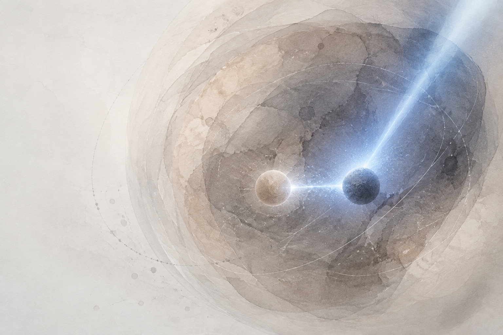

::: {.article-type}
PAPER ANALYSIS · 12 MIN READ
:::

::: {.article-deck}
SLK was not hidden because nobody had measured its RNA or protein. It was hidden because the relevant biology depended on an isoform entering the right compartment and approaching c-Myc during a limited interaction window.
:::

{.article-cover fig-alt="Abstract warm-gray nuclear field crossed by a brief blue pulse connecting two subtle nodes"}

::: {.evidence-card}
### Bottom line

A recent *Nature Chemical Biology* study identifies STE20-like kinase (SLK) as a regulator of c-Myc stability in PC-3 prostate cancer cells [@milione2026]. The functional evidence is persuasive in this cellular context. The isoform-specific and catalytic mechanism is compelling but not yet fully closed: the decisive rescue experiment comparing SLK isoforms, localization, and kinase activity remains to be done.
:::

c-Myc is one of the best-studied cancer proteins, yet it remains difficult to drug directly. One alternative is to identify proteins that cancer cells use to maintain c-Myc expression or stability. The study by Milione and colleagues takes this approach and finds SLK—a kinase that conventional mutation- or expression-centered searches would have been unlikely to prioritize [@milione2026].

What interested me most was not simply the addition of another kinase to the c-Myc network. It was **why SLK had escaped detection for so long**.

## The relevant signal was invisible to conventional databases

SLK would not stand out as an obvious cancer driver in a typical bioinformatics analysis. It is not commonly defined by recurrent cancer mutations, strong gene amplification, or a striking increase in bulk RNA or protein abundance. Although SLK and c-Myc show some degree of co-dependency in certain cancer cell lines, co-dependency alone does not reveal the biological connection between them.

The paper suggests that the important variable is neither total SLK expression nor mutation status. It is **which SLK isoform is expressed and where that isoform is located**.

PC-3 cells preferentially express SLK-L, a longer splice isoform containing exon 13 and a putative nuclear localization signal. Total SLK abundance was similar among the prostate cell lines examined, but nuclear SLK was elevated in PC-3 cells. This brings SLK into the same compartment as c-Myc and creates an opportunity for a functional interaction [@milione2026].

This is the type of relationship that conventional cancer databases are poorly equipped to uncover. Gene-level RNA analysis often combines multiple transcripts into one value. Standard proteomics may quantify total SLK without reliably distinguishing SLK-L from SLK-S. Even a dependency screen can tell us only that a cell needs SLK. It cannot explain whether that dependency involves c-Myc, mitosis, focal adhesions, or another SLK function.

::: {.interpretation-note}
**My interpretation.** The paper supports SLK-L as the likely c-Myc-relevant isoform. It does not establish that only SLK-L can stabilize c-Myc, because the authors did not directly compare the two isoforms in a controlled rescue experiment. SLK-S might also support c-Myc if it were artificially directed into the nucleus. That distinction would show whether exon 13 contributes a unique molecular function or mainly provides nuclear access.
:::

The broader conclusion is persuasive: a cancer dependency can arise from altered splicing and localization without producing a conspicuous change in total RNA or protein. A database search centered on mutation and expression would probably never have prioritized SLK as a c-Myc regulator.

## A short snapshot of the c-Myc neighborhood

The authors found SLK using µMap, a photoproximity-labeling method. They attached an iridium photocatalyst to c-Myc in biochemically intact isolated nuclei, added a diazirine-biotin probe, and irradiated the sample with blue light for one minute. Light activation generated short-lived reactive carbenes that labeled proteins close to c-Myc—within an estimated radius of approximately 4 nm in this implementation [@milione2026; @seath2023].

This short labeling period is important. Methods such as BioID use a promiscuous biotin ligase and typically integrate proximity over much longer labeling windows [@roux2012]. That broad history can be useful, but it also creates a larger candidate list when the bait is a mobile nuclear protein associated with extensive chromatin complexes.

In a same-cell-line comparison in PC-3 cells, BioID yielded 1,563 proteins and µMap yielded 519. Both methods recovered comparable numbers of known c-Myc interactions, but SLK was enriched by µMap and not identified by BioID [@milione2026]. The smaller µMap result reduced the candidate space by roughly threefold.

The comparison does not prove that spatial resolution alone explains the difference. The experiments also differed in labeling duration, cellular compartment, fusion design, reaction chemistry, acquisition method, and proteasome-inhibitor treatment. BioID was performed in whole cells over 24 hours, whereas µMap captured a one-minute interval in isolated nuclei [@milione2026].

For me, the value of µMap is therefore not simply that it labels a smaller radius. Its more useful feature is **experimental control**. The investigator can choose the compartment and the moment in which the protein neighborhood is recorded. This may help uncover low-abundance or conditional interactions that disappear inside a large, time-integrated interactome.

## How strongly does SLK regulate c-Myc?

The functional data go well beyond the initial proximity signal. SLK co-immunoprecipitated with c-Myc in PC-3 cells. Knocking out SLK reduced c-Myc protein to approximately 20% of the wild-type level, while the reduction in *MYC* RNA was much smaller [@milione2026].

The c-Myc half-life decreased from 138 minutes to 60 minutes after SLK knockout. Under a first-order degradation model, the degradation-rate ratio is:

$$
\frac{k_{\mathrm{KO}}}{k_{\mathrm{WT}}}
= \frac{\ln 2 / 60}{\ln 2 / 138}
= \frac{138}{60}
\approx 2.3
$$

This derived estimate corresponds to an approximately 2.3-fold increase in the apparent degradation rate. Re-expressing c-Myc rescued target-gene expression, proliferation, cell-cycle progression, and cellular morphology after SLK loss. SLK-knockout cells also failed to establish tumors in the reported PC-3 xenograft experiment [@milione2026].

Together, these experiments make a strong case that SLK supports c-Myc stability and c-Myc-dependent growth in PC-3 cells.

## The proposed mechanism is not yet closed

The authors propose that SLK phosphorylates c-Myc at serine 329, which reduces GSK3β-dependent phosphorylation at threonine 58 and protects c-Myc from degradation. Recombinant SLK phosphorylated c-Myc at S329 in vitro; an S329A c-Myc mutant was less stable, whereas the phosphomimetic S329D mutant was more stable. In vitro experiments and a cellular proximity-ligation assay also support competition between SLK and GSK3β for c-Myc binding [@milione2026].

However, the paper does not demonstrate that endogenous S329 phosphorylation falls after SLK knockout. It also does not show that wild-type SLK rescues c-Myc stability while kinase-dead SLK fails to do so. SLK may phosphorylate c-Myc directly in cells, but it could also stabilize c-Myc partly by acting as a scaffold or by interfering with GSK3β binding.

::: {.next-experiment}
### The experiment I would run next

Compare **SLK-L**, **kinase-dead SLK-L**, **SLK-S**, and **nuclear-targeted SLK-S** in SLK-knockout PC-3 cells. Measure endogenous c-Myc S329 and T58 phosphorylation together with c-Myc half-life.

- If only catalytically active SLK-L rescues the phenotype, kinase activity and isoform context are both required.
- If nuclear-targeted SLK-S rescues, exon 13 may act mainly through localization.
- If kinase-dead nuclear SLK still provides partial rescue, scaffolding or competition with GSK3β probably contributes.
:::

That comparison would separate catalytic activity from localization and scaffolding.

## Could µMap help identify E3-ligase substrates?

The study also made me think about a broader application. Photoproximity labeling may be particularly useful for finding substrates of E3 ubiquitin ligases.

E3–substrate interactions are often weak and transient. Once ubiquitinated, the substrate may leave the ligase complex and be degraded rapidly. A long labeling window can accumulate many proteins that share a compartment with the E3 ligase but are not substrates. A short pulse could provide a cleaner snapshot of proteins present near the ligase during substrate recognition.

Compartment control would add another advantage. The same E3 ligase can encounter different substrates in the nucleus, cytoplasm, or at specific membranes. Restricting µMap to one compartment could reduce unrelated proteins and expose context-specific substrates.

::: {.proposal-note}
**Proposed application—not established by this paper.** Proximity alone would not show that a labeled protein is an E3 substrate. Useful controls would include a ligase-dead mutant, acute proteasome inhibition, time-resolved labeling, and direct measurements of ubiquitination or protein stability. Comparing active and inactive ligases could distinguish proteins that merely occupy the same space from proteins whose proximity depends on catalytic substrate engagement.
:::

That may be where photoproximity labeling has its greatest value. It does not replace genetics, biochemistry, or ubiquitin proteomics. It gives those methods a shorter and more biologically focused list of candidates to test.

## What would change my mind?

My interpretation would weaken if controlled isoform-rescue experiments showed that SLK-S supports c-Myc stability without nuclear localization, if loss of SLK left endogenous c-Myc S329 phosphorylation unchanged under conditions with verified assay sensitivity, or if the SLK–c-Myc dependency failed to reproduce beyond the reported cellular contexts.

The current study nevertheless illustrates a useful principle. SLK was not hidden because nobody had measured its RNA or protein. It was hidden because the relevant biology depended on an isoform entering the right compartment and approaching c-Myc during a limited interaction window. µMap provided a way to see that event.

::: {.evidence-note}
### Evidence note

**Reported:** interactome sizes, localization, co-immunoprecipitation, knockout effects, half-lives, rescue experiments, xenograft outcome, and the biochemical S329/GSK3β experiments come from Milione and colleagues [@milione2026].

**Derived:** the approximately 2.3-fold change in apparent degradation rate is calculated above from the reported half-lives, assuming first-order degradation.

**Inferred:** SLK-L is probably the c-Myc-relevant isoform, but isoform specificity and the necessity of SLK catalytic activity remain incompletely tested.

**Proposed:** the E3-ligase application and the four-arm SLK rescue experiment are the author's suggestions.
:::

  <a href="https://www.linkedin.com/sharing/share-offsite/?url=https%3A%2F%2Fichunglo.github.io%2Fposts%2F2026-09-04-photoproximity-labeling-hidden-regulator-c-myc%2F" target="_blank" rel="noopener noreferrer">Share on LinkedIn</a>
  <a href="mailto:ichunglo@protonmail.com?subject=The%20Edge%20of%20Evidence">Email iLo</a>

## References

::: {#refs}
:::

::: {.article-disclosure}
**Article history:** First published September 4, 2026. No substantive corrections.

**Cover note:** Cover art may be AI-generated. Scientific interpretation is edited and reviewed by the author.
:::
